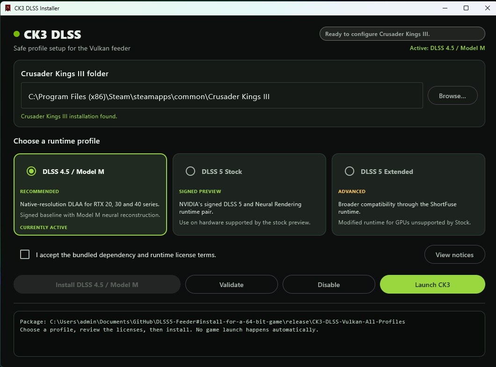

# Crusader Kings III DLSS Vulkan

<p align="center">
  
</p>

<p align="center">
  <a href="https://img.shields.io/badge/Vulkan-1.3-blue?style=for-the-badge&logo=vulkan">
  <a href="https://img.shields.io/badge/C%2B%2B-17-blue?style=for-the-badge">
  <a href="https://img.shields.io/badge/ReShade-blue?style=for-the-badge">
  <a href="https://img.shields.io/badge/DLSS-NVIDIA-orange?style=for-the-badge">
  <a href="https://img.shields.io/badge/Kotlin-1.9-blue?style=for-the-badge">
  <a href="https://img.shields.io/badge/PowerShell-scripts-blue?style=for-the-badge">
</p>

Drag-and-drop Vulkan/ReShade/DLSS integration for the Windows version of **Crusader Kings III**.

The package changes CK3 to Vulkan, loads ReShade and the DLSS feeder through package-local Vulkan
layers, bootstraps RenoDX through its own app-local `binaries\dxgi.dll`, and provides four selectable
runtime profiles. It does not replace `ck3.exe`, register a global Vulkan layer, or affect other games.

<!-- TOC start -->
## Table of Contents

- [Download](#download)
- [Install](#install)
- [Runtime Profiles](#runtime-profiles)
- [ReShade Controls](#reshade-controls)
- [DXGI Bridge](#dxgi-bridge)
- [Installer Changes](#installer-changes)
- [Package Layout](#package-layout)
- [Build from Source](#build-from-source)
- [Troubleshooting](#troubleshooting)
<!-- TOC end -->

## Download

Download **`CK3-DLSS-Vulkan-All-Profiles.zip`** from the latest GitHub release.

## Install

1. Close Crusader Kings III and the Paradox launcher.
2. In Steam, right-click **Crusader Kings III**, then select **Manage → Browse local files**.
3. Copy everything inside `CK3-DLSS-Vulkan-All-Profiles.zip` directly into the CK3 folder.
4. Confirm `Launch CK3 with DLSS.cmd` is beside the existing `binaries`, `game`, and `launcher`
   folders. Do not extract the package directly into `binaries` or leave it inside an extra folder.
5. Run **`Open CK3 DLSS Installer.cmd`**. The desktop app checks the game folder, shows the active
   profile, explains the three supported choices, and requires license acknowledgement before it
   enables installation:

   - **DLSS 4.5 Model M** — recommended baseline.
   - **DLSS 5 Stock** — signed DLSS 5 Neural Rendering runtime.
   - **DLSS 5 Extended** — experimental compatibility runtime.

   The original profile-specific `.cmd` installers remain available as command-line fallbacks.

6. Start CK3 with **`Launch CK3 with DLSS.cmd`**.

The included launcher is required because it supplies the local Vulkan-layer environment. Steam's
normal Play button does not activate this package.

## Runtime profiles

The fourth installer, **`Install CK3 DLSS Native Streamline Experimental.cmd`**, enables the opt-in
native Streamline Vulkan experiment.

| Profile | Components | Intended use |
|---|---|---|
| **DLSS 4.5 Neural Reconstruction / DLAA** | Local feeder + NVIDIA DLSS runtime | RTX 20/30/40 baseline; second-generation transformer Model M (`preset=13`) by default |
| **DLSS 5 Stock** | Feeder + RenoDX + signed DLSS/Neural Rendering pair | Hardware supported by the stock preview runtime |
| **DLSS 5 Extended** | Feeder + RenoDX + modified ShortFuse Neural Rendering runtime | Experimental compatibility testing |
| **Native Streamline Vulkan** | NVIDIA Streamline interposer + DLSS/DLSS-RR plugins + stock NGX fallback | Experimental Vulkan interception and integration testing |

DLSS 4.5 uses native-resolution DLAA with Model M neural reconstruction across the entire frame,
including character faces. It consumes the current color frame, depth, and motion vectors to reconstruct
a temporally stable native-resolution result; it is not an upscaling performance mode. This is distinct
from the separate DLSS 5 Neural Rendering extension. The Extended profile is experimental and may be unstable.

Native Streamline initializes NVIDIA's Vulkan interposer before CK3 loads `vulkan-1.dll`. A
compatibility shim keeps the system Vulkan loader handle expected by CK3 and owns
`vkGetInstanceProcAddr` plus `vkGetDeviceProcAddr`. Device and swapchain calls continue through Streamline,
while Win32 surface creation, destruction, presentation support, and capability queries use the system
Vulkan loader to avoid the donor interposer's unbound surface thunk during CK3's device-first startup.
The feeder's existing NGX path remains the evaluator fallback; direct Streamline resource tagging and
feature evaluation are not yet implemented.

To change profiles, close CK3 and reopen **`Open CK3 DLSS Installer.cmd`**. You can also use the
profile-specific installers or **`Configure CK3 DLSS Runtime.cmd`** from a terminal.

## ReShade Controls

Press **Home** in game to open ReShade. The focused preset contains:

1. `vort_MotionEffects`
2. `DLSS5_Feed`
3. `vort_StaticEffects`

Keep `vort_MotionEffects` above `DLSS5_Feed`. Lilium HDR Shaders 2026.02.28 are bundled for HDR
analysis, tone mapping, inverse tone mapping, black-floor correction, and HDR-aware sharpening.
Other general-purpose shader collections are not included.

Feeder controls, including DLSS preset selection, appear in ReShade's **Add-ons** tab. DLSS 5
profiles also expose RenoDX/Neural Rendering controls.

## DXGI Bridge

CK3's Vulkan renderer does not naturally load a DXGI proxy or create a D3D12 presentation runtime.
That matters because the RenoDX DLSS 5 add-on hooks the D3D12 NGX entry points. When RHI installs
ReShade as `dxgi.dll` for a D3D12 game, ReShade starts early and RenoDX observes the D3D12 device,
runtime, and presentation lifecycle before the game creates or evaluates its DLSS feature. Loading
ReShade only as a Vulkan layer discovers the add-ons, but by itself does not guarantee that those
D3D12 hooks are armed.

This package therefore includes its own x64 `binaries\dxgi.dll`. It is not a replacement Vulkan
driver and it does not translate all CK3 rendering to D3D12. The package's Vulkan layer explicitly
calls its `DLSS5Bootstrap` export before Vulkan device creation. The bridge then:

1. Loads the package's private full-add-on `ReShade64.dll` through its DXGI exports.
2. Creates a hidden D3D12 device, command queue, and DXGI swapchain.
3. Performs an initial `Present` so ReShade and RenoDX receive the initialization events they expect.
4. Keeps that hidden runtime alive while the feeder creates its private D3D12 device and DLSS feature.
5. Leaves the existing Vulkan/D3D12 shared-texture and shared-fence transport responsible for moving
   CK3's frame to DLSS and returning the processed result to Vulkan.

For the opt-in Native Streamline profile, the bridge calls `slInit` for Vulkan with the DLSS and
DLSS-RR plugins when CK3 dynamically loads `vulkan-1.dll`. It returns the normal system Vulkan
loader handle, tracks surviving instances across CK3's temporary probes, and routes proc-address
lookups through typed wrappers. Surface operations use the system Vulkan loader; device and swapchain
operations remain routed through Streamline. If initialization fails, CK3 uses the normal Vulkan
loader without interception. The package records the result in `binaries\dlss5-dxgi.log`.

```text
CK3 Vulkan -> package Vulkan layers -> shared textures/fences
                                      -> private D3D12 feeder -> DLSS
                         dxgi.dll -> hidden DXGI/D3D12 runtime
                                  -> ReShade/RenoDX hook initialization
```

The bridge is package-local and affects no other game. RHI may remain installed: the launcher sets
`DISABLE_VK_LAYER_reshade_1=1` only for the CK3 process to suppress a separately registered global
ReShade Vulkan layer, while the package manifest uses its own disable key and remains active. Do not
let RHI or another injector replace this package's `binaries\dxgi.dll`; it contains the custom
`DLSS5Bootstrap` entry point that the Vulkan layer requires.

## Installer Changes

- Validates the bundled x64 renderer and runtime files.
- Creates `binaries\dlss-active` containing only the selected profile.
- Backs up CK3's current renderer setting.
- Changes `Graphics.renderer` to `Vulkan`.
- Keeps ReShade and both Vulkan layers local to CK3.
- Installs its own `binaries\dxgi.dll` bootstrap so RenoDX sees the feeder's private D3D12 device.

Run **`Disable CK3 DLSS.cmd`** to restore the renderer recorded before installation. The package's
Vulkan layers are inactive when CK3 is launched normally.

## Package layout

```text
Crusader Kings III\
  Open CK3 DLSS Installer.cmd
  Install CK3 DLSS.cmd
  Install CK3 DLSS 4.5 RTX 3060 Test.cmd
  Install CK3 DLSS 5 Stock Test.cmd
  Install CK3 DLSS 5 Extended Test.cmd
  Install CK3 DLSS Native Streamline Experimental.cmd
  Configure CK3 DLSS Runtime.cmd
  Launch CK3 with DLSS.cmd
  Disable CK3 DLSS.cmd
  DLSS5-CK3.ps1
  DLSS-Runtime-Setup.ps1
  Graphics-Dependency-Setup.ps1
  tools\
    CK3-DLSS-Installer\
      CK3 DLSS Installer.exe
    RHI-Setup.exe
  binaries\
    ck3.exe                              (provided by CK3)
    dxgi.dll                             (this package's DXGI/D3D12 bootstrap)
    ReShade.ini
    DLSS5-CK3.ini
    dlss5-vulkan\
      ReShade64.dll
      ReShade64.json
      VkLayer_feed_vk.dll
      VkLayer_feed_vk.json
    dlss-payload\
      dlss5-feed.addon64
    dlss-active\                         (created by the installer)
    reshade-shaders\Shaders\
      DLSS5_Feed.fx
    third-party\vort_Shaders\
```

## Build from this repository

The release feeder and Vulkan layer are compiled from the current working tree. Building does not
require pulling or replacing the checkout.

Requirements:

- Visual Studio 2022 Build Tools with the MSVC x64 toolchain and Windows SDK.
- NVIDIA NGX SDK headers and `nvsdk_ngx_d.lib` under `external\ngx`.
- Khronos Vulkan headers under `external\vulkan`.
- JDK 17 for the optional Compose Desktop installer GUI.

Build the local feeder and layer:

```cmd
build-local-current-tree.cmd
layer\build-layer-local.cmd
```

Outputs:

```text
build\dlss5-feed.addon64
layer\VkLayer_feed_vk.dll
layer\dxgi.dll
```

## Troubleshooting

- **`binaries\ck3.exe was not found`** — extract the ZIP into the CK3 root, one directory higher.
- **Validation failed** — close CK3, extract the ZIP again with overwrite enabled, and rerun the
  selected profile installer.
- **No ReShade overlay** — launch with `Launch CK3 with DLSS.cmd`, not Steam's normal Play button.
- **DXGI bootstrap failed** — inspect `binaries\dlss5-dxgi.log` and
  `binaries\dlss5-vulkan\feed-vk-layer.log`. A successful start records the hidden D3D12 `Present`
  and a `private DXGI/ReShade bootstrap -> 0x00000000` result.
- **RHI or ReShade asks to replace `dxgi.dll`** — decline that replacement for CK3. The file in
  `binaries` is this package's Vulkan-to-D3D12 bootstrap, not a stock ReShade proxy.
- **Shader selection** — the package includes its DLSS/VORT effects and the complete Lilium HDR
  suite, not every general-purpose ReShade collection.
- **Need to recover** — run `Disable CK3 DLSS.cmd`, then launch CK3 normally.

The default profile is native-resolution DLAA with Model M neural reconstruction, not an upscaling
performance mode. The reconstruction processes the entire frame, including character faces, using
color, depth, and motion-vector inputs.

For the opt-in Native Streamline profile, the bridge calls `slInit` for Vulkan with the DLSS and
DLSS-RR plugins when CK3 dynamically loads `vulkan-1.dll`. It returns the normal system Vulkan
loader handle, tracks surviving instances across CK3's temporary probes, and routes proc-address
lookups through typed wrappers. Surface operations use the system Vulkan loader; device and swapchain
operations remain routed through Streamline. If initialization fails, CK3 uses the normal Vulkan
loader without interception. The package records the result in `binaries\dlss5-dxgi.log`.

```text
CK3 Vulkan -> package Vulkan layers -> shared textures/fences
                                      -> private D3D12 feeder -> DLSS
                         dxgi.dll -> hidden DXGI/D3D12 runtime
                                  -> ReShade/RenoDX hook initialization
```

The bridge is package-local and affects no other game. RHI may remain installed: the launcher sets
`DISABLE_VK_LAYER_reshade_1=1` only for the CK3 process to suppress a separately registered global
ReShade Vulkan layer, while the package manifest uses its own disable key and remains active. Do not
let RHI or another injector replace this package's `binaries\dxgi.dll`; it contains the custom
`DLSS5Bootstrap` entry point that the Vulkan layer requires.

## What the installer changes

- Validates the bundled x64 renderer and runtime files.
- Creates `binaries\dlss-active` containing only the selected profile.
- Backs up CK3's current renderer setting.
- Changes `Graphics.renderer` to `Vulkan`.
- Keeps ReShade and both Vulkan layers local to CK3.
- Installs its own `binaries\dxgi.dll` bootstrap so RenoDX sees the feeder's private D3D12 device.

Run **`Disable CK3 DLSS.cmd`** to restore the renderer recorded before installation. The package's
Vulkan layers are inactive when CK3 is launched normally.

## Package layout

```text
Crusader Kings III\
  Open CK3 DLSS Installer.cmd
  Install CK3 DLSS.cmd
  Install CK3 DLSS 4.5 RTX 3060 Test.cmd
  Install CK3 DLSS 5 Stock Test.cmd
  Install CK3 DLSS 5 Extended Test.cmd
  Install CK3 DLSS Native Streamline Experimental.cmd
  Configure CK3 DLSS Runtime.cmd
  Launch CK3 with DLSS.cmd
  Disable CK3 DLSS.cmd
  DLSS5-CK3.ps1
  DLSS-Runtime-Setup.ps1
  Graphics-Dependency-Setup.ps1
  tools\
    CK3-DLSS-Installer\
      CK3 DLSS Installer.exe
    RHI-Setup.exe
  binaries\
    ck3.exe                              (provided by CK3)
    dxgi.dll                             (this package's DXGI/D3D12 bootstrap)
    ReShade.ini
    DLSS5-CK3.ini
    dlss5-vulkan\
      ReShade64.dll
      ReShade64.json
      VkLayer_feed_vk.dll
      VkLayer_feed_vk.json
    dlss-payload\
      dlss5-feed.addon64
      runtimes\DLSS45\...
      runtimes\DLSS5\...
      runtimes\DLSS5Extended\...
      runtimes\NativeStreamline\...
    dlss-active\                         (created by the installer)
    reshade-shaders\Shaders\
      DLSS5_Feed.fx
    third-party\vort_Shaders\
```

## Build from this repository

The release feeder and Vulkan layer are compiled from the current working tree. Building does not
require pulling or replacing the checkout.

Requirements:

- Visual Studio 2022 Build Tools with the MSVC x64 toolchain and Windows SDK.
- NVIDIA NGX SDK headers and `nvsdk_ngx_d.lib` under `external\ngx`.
- Khronos Vulkan headers under `external\vulkan`.
- JDK 17 for the optional Compose Desktop installer GUI.

Build the local feeder and layer:

```cmd
build-local-current-tree.cmd
layer\build-layer-local.cmd
```

Outputs:

```text
build\dlss5-feed.addon64
layer\VkLayer_feed_vk.dll
layer\dxgi.dll
```

CK3 packaging scripts and the drag-and-drop template are under [`ck3-package`](ck3-package).
Build and stage the self-contained installer app before creating a release package:

```powershell
.\Build-Installer-GUI.ps1
```

## Known limitations

- This is experimental prototype software.
- CK3 has no native DLSS motion-vector integration. VORT estimates motion vectors, so fast map
  movement, UI elements, smoke, and transparency can ghost.
- The CK3 interface is part of the processed frame.
- RHI may remain installed. The launcher disables RHI/global ReShade Vulkan registration only inside
  the CK3 process and explicitly loads this package's private layers.
- Do not replace `binaries\dxgi.dll` with another ReShade proxy or combine the active package with
  OptiScaler, Smooth Motion, or a second DLSS/Streamline injector.
- Native Streamline is a bootstrap/interposer experiment; the existing NGX feeder remains available
  as its evaluator fallback.
- The donor Streamline runtime does not have a valid NVIDIA application identity for CK3, so direct
  NGX features may remain disabled until supported project identity and resource tagging are added.

## Troubleshooting

- **`binaries\ck3.exe was not found`** — extract the ZIP into the CK3 root, one directory higher.
- **Validation failed** — close CK3, extract the ZIP again with overwrite enabled, and rerun the
  selected profile installer.
- **No ReShade overlay** — launch with `Launch CK3 with DLSS.cmd`, not Steam's normal Play button.
- **DXGI bootstrap failed** — inspect `binaries\dlss5-dxgi.log` and
  `binaries\dlss5-vulkan\feed-vk-layer.log`. A successful start records the hidden D3D12 `Present`
  and a `private DXGI/ReShade bootstrap -> 0x00000000` result.
- **RHI or ReShade asks to replace `dxgi.dll`** — decline that replacement for CK3. The file in
  `binaries` is this package's Vulkan-to-D3D12 bootstrap, not a stock ReShade proxy.
- **Shader selection** — the package includes its DLSS/VORT effects and the complete Lilium HDR
  suite, not every general-purpose ReShade collection.
- **Need to recover** — run `Disable CK3 DLSS.cmd`, then launch CK3 normally.
- **Profile not switching** — close CK3 completely, then reopen `Open CK3 DLSS Installer.cmd`.
  Each profile switch rebuilds `binaries\dlss-active` so files from the previous profile are
  not left loaded. Ensure no other DLSS/ReShade injectors are active.
- **Motion vector ghosting** — CK3 has no native DLSS motion-vector integration. VORT estimates
  motion, so fast map movement, UI elements, smoke, and transparency can ghost. This is a known
  limitation of the prototype.
- **Streamline features disabled** — the donor Streamline runtime does not have a valid NVIDIA
  application identity for CK3, so direct NGX features may remain disabled until supported
  project identity and resource tagging are added.
- **ReShade preset not loading** — ensure `vort_MotionEffects` is above `DLSS5_Feed` in the
  ReShade effect list. The focused preset intentionally contains these effects in this order.
- **DLSS model not changing** — use ReShade's Add-ons tab -> DLSS 5 Feed -> Neural reconstruction
  model to switch live among Runtime Default, E, F, J, K, L, and M. The selection is saved to
  `dlss5-feed.cfg`.
- **RenoDX/Neural Rendering controls missing** — DLSS 5 profiles also expose controls for the
  separate RenoDX/Neural Rendering extension in ReShade's Add-ons tab.

## Included projects

- DLSS5 Feeder
- ReShade
- VORT shaders
- RenoDX/RHI runtime integration
- NVIDIA DLSS runtimes

See [`THIRD-PARTY-NOTICES.md`](ck3-package/THIRD-PARTY-NOTICES.md) and
[`THIRD-PARTY-LICENSES`](ck3-package/THIRD-PARTY-LICENSES) for bundled-component notices.
